# ⚡ QuickDrop – AI-Powered Rapid Grocery Delivery Platform

[](https://dotnet.microsoft.com/en-us/apps/maui)
[](https://docs.microsoft.com/en-us/dotnet/csharp/)
[-003B57?logo=sqlite)](https://www.sqlite.org/)
[](https://deepmind.google/technologies/gemini/)
[](#)
[](LICENSE)

> **QuickDrop** is an end-to-end, multi-role on-demand grocery and grocery commerce platform built with **.NET MAUI 9** and **C# 12**. Features real-time multi-portal management (Customer, Super Admin, Vendor, Rider), intelligent **Google Gemini AI** recipe-to-cart automation, GPS/IP geocoding address discovery, interactive gamification, and an offline-first SQLite persistence engine.

---

## 📌 Table of Contents

- [Overview](#-overview)
- [Screenshots & UI Showcase](#-screenshots--ui-showcase)
- [Key Features](#-key-features)
  - [1. Multi-Portal Architecture & Roles](#1-multi-portal-architecture--roles)
  - [2. Google Gemini AI Engine](#2-google-gemini-ai-engine)
  - [3. Dynamic Geolocation & Live Address Detection](#3-dynamic-geolocation--live-address-detection)
  - [4. Order Lifecycle & Dual Rating Engine](#4-order-lifecycle--dual-rating-engine)
  - [5. Gamification (Wheel of Fortune)](#5-gamification-wheel-of-fortune)
  - [6. Modern SaaS Design System](#6-modern-saas-design-system)
- [Demo Credentials](#-demo-credentials)
- [Tech Stack](#-tech-stack)
- [Project Structure](#-project-structure)
- [Getting Started](#-getting-started)
  - [Prerequisites](#prerequisites)
  - [Installation & Build](#installation--build)
  - [Configuring Google Gemini API](#configuring-google-gemini-api)
- [Contributing](#-contributing)
- [License](#-license)

---

## 🚀 Overview

QuickDrop bridges rapid retail commerce and intelligent culinary planning. Rather than traditional static catalogs, QuickDrop combines **generative AI meal planning** with **direct grocery basket fulfillment**, synchronized dispatch queues for delivery couriers, real-time store monitoring for vendors, and administrative tools for super administrators.

---

## 📱 Screenshots & UI Showcase

<div align="center">

### 🛍️ Storefront & Discovery
| Home & Deals | Categories | Product Details | Cart & Checkout |
| :---: | :---: | :---: | :---: |
| 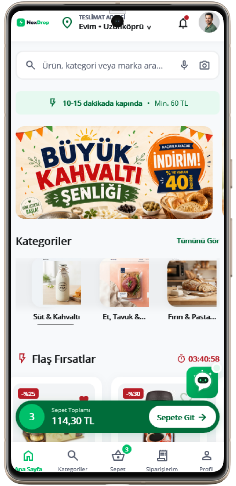 | 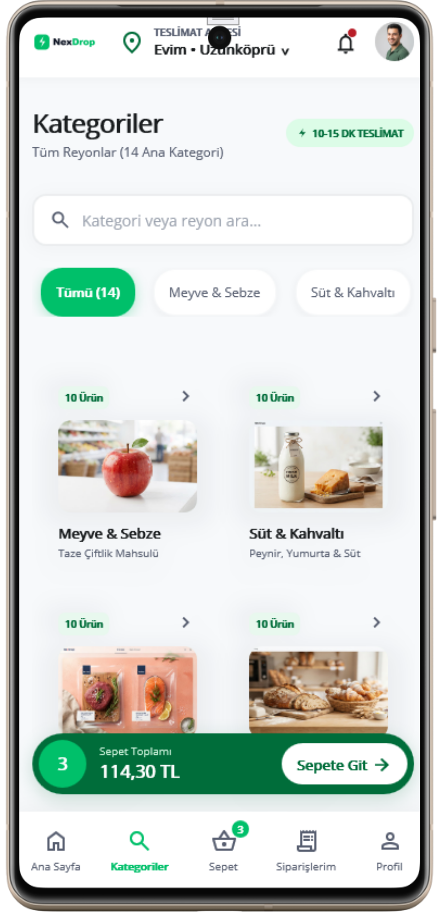 | 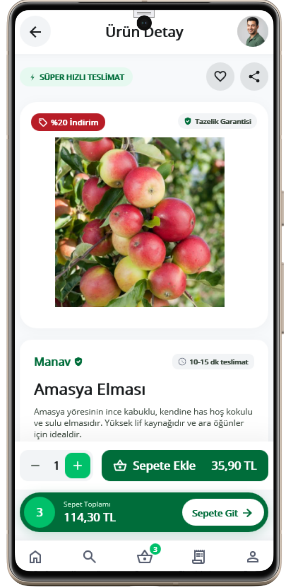 | 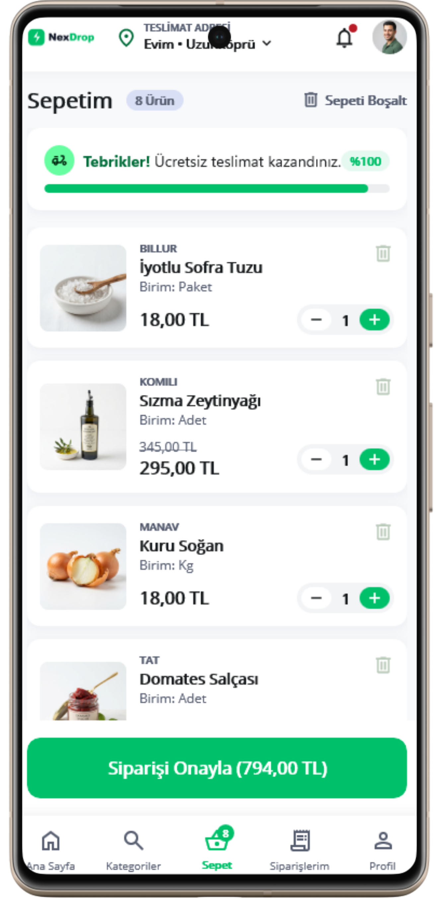 |

### 🤖 Gemini AI Recipe Generator & Orders
| AI Recipe Assistant | Ingredients to Cart | Live Tracking | Order History |
| :---: | :---: | :---: | :---: |
| 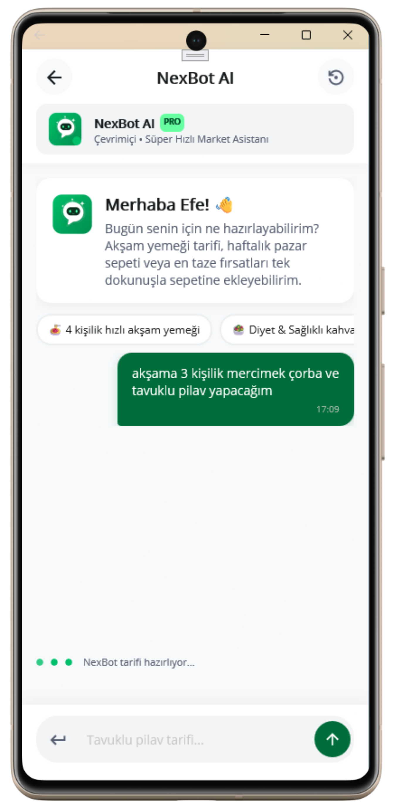 | 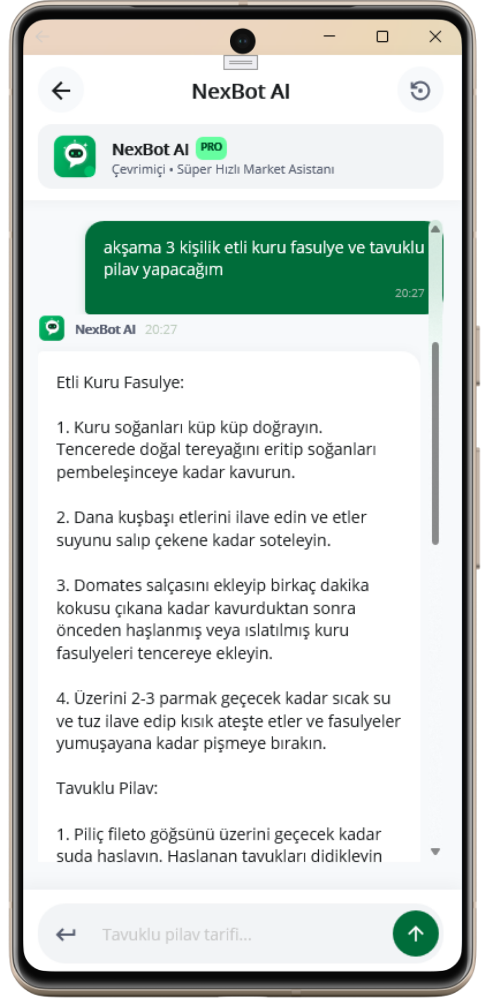 | 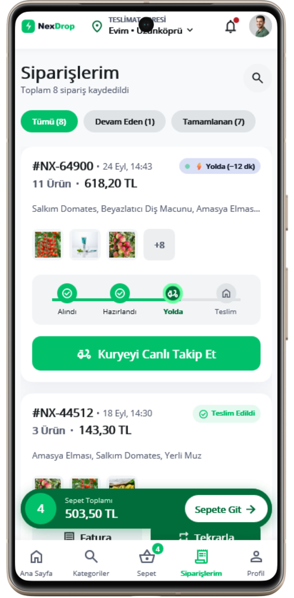 | 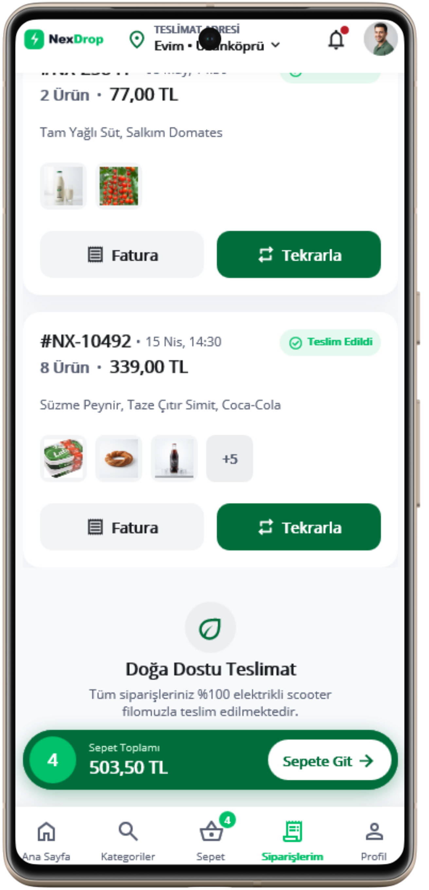 |

### ⚡ Gamification, Analytics & Profile
| Wheel of Fortune | Rewards & Coupons | Analytics & KPIs | User Profile |
| :---: | :---: | :---: | :---: |
| 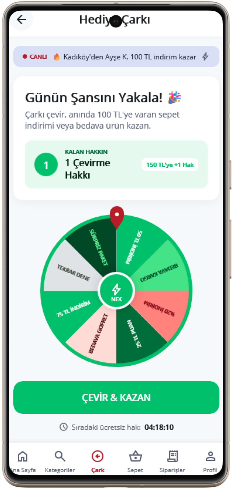 | 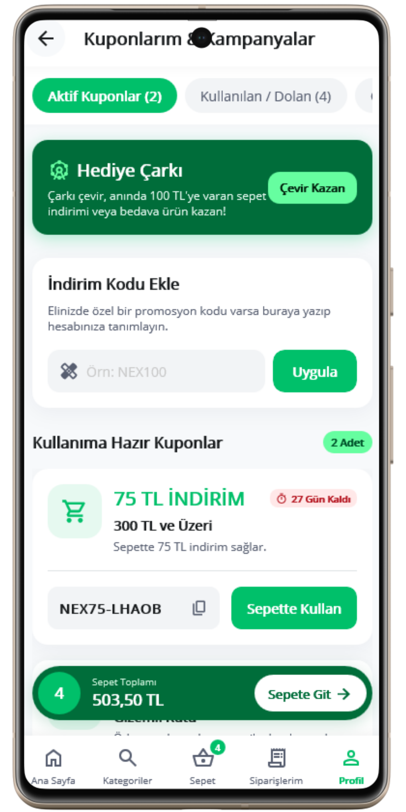 | 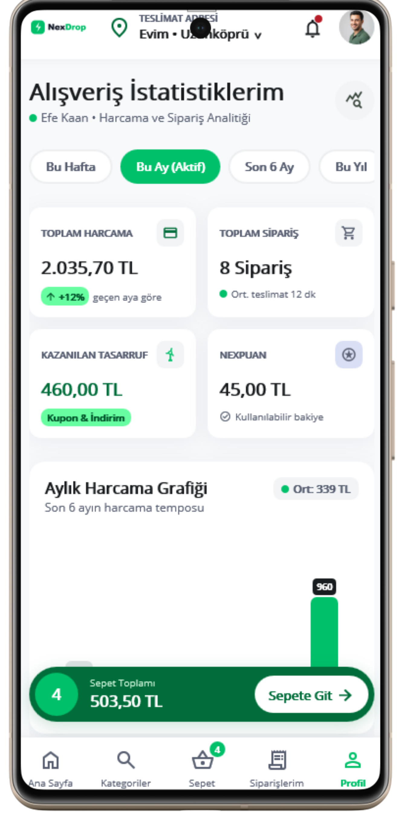 | 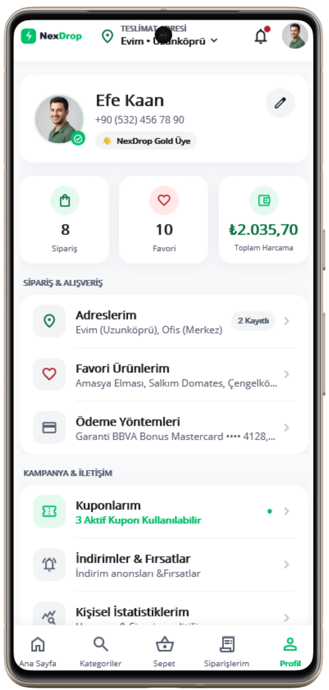 |

</div>

---

## 🌟 Key Features

### 1. Multi-Portal Architecture & Roles
QuickDrop adapts dynamically to the authenticated role:
* **👤 Customer Storefront (`HomePage`, `ProductsPage`, `CartPage`, `OrdersPage`):**
  - Category filtering, real-time search, discount badges, and flash deals.
  - Interactive cart with promo codes, subtotal/tax/delivery computations, and multi-address selection.
* **⚡ Super Admin Console (`AdminPanelPage`):**
  - System-wide KPI dashboard (Total Revenue, Active Orders, Stock Valuation, Account Counts).
  - User and permissions control with role cycling (`Customer ➔ Rider ➔ Vendor ➔ Admin`).
  - Direct account creation wizard with password hashing and validation.
* **🏪 Vendor Hub (`AdminPanelPage`):**
  - Real-time catalog & inventory management with one-click stock steppers.
  - New product creation with image URIs, pricing, categories, and unit volume.
  - Review feed prioritizing customer ratings for food quality and freshness.
* **🛵 Rider / Courier Console (`RiderPage`):**
  - Shift dashboard tracking active drops, completed runs, and calculated shift earnings.
  - Order dispatch queue: `Ready for Pickup` ➔ `On Delivery` ➔ `Delivered`.
  - In-app customer phone dialer and live address navigation integration.

---

### 2. 🧠 Google Gemini AI Engine
* **Natural Language Meal Planning:** Users enter what they want to cook (e.g. *"Healthy Mediterranean Chicken Salad"* or *"Quick Vegan Pasta"*).
* **Automated Ingredient Parsing & Basket Matching:** Gemini breaks down recipes into individual ingredient items, checks catalog inventory, and automatically populates the user's shopping cart with available quantities.
* **Fallback Simulation:** Built-in resilience with intelligent offline recipe catalog fallbacks when network connectivity or API quotas are restricted.

---

### 3. 📍 Dynamic Geolocation & Live Address Detection
* **Dual-Tier Geolocation (`LocationService`):**
  1. **Device Sensor GPS Geocoding:** Leverages `Microsoft.Maui.Devices.Sensors` for native high-accuracy device location.
  2. **IP Geolocation Fallback:** Automatic zero-permission fallback using `ip-api.com` to resolve City, Country, ZIP, and Street context.
* **Automatic Session Sync:** Dynamically sets and creates active delivery addresses upon user registration and login.
* **Manual Address Book:** Saved locations (Home, Work, Other) with instant active-address switching across all storefront views.

---

### 4. ⭐ Order Lifecycle & Dual Rating Engine
* **End-to-End Status Tracking:** `Pending` ➔ `Preparing` ➔ `OnTheWay` ➔ `Delivered` ➔ `Cancelled`.
* **Independent Dual Feedback (`ReviewOrderPage`):**
  - **🛵 Rider Rating (1 to 5 Stars):** Evaluates courier speed, friendliness, and delivery care.
  - **🍲 Food/Vendor Quality (1 to 5 Stars):** Evaluates product freshness, packaging, and order accuracy.
  - Custom written feedback and comments stored per order.
* **Sort & Prioritization:** Admins and vendors can filter review feeds by Lowest/Highest food quality or rider ratings to immediately catch service bottlenecks.

---

### 5. 🎡 Gamification (Wheel of Fortune)
* Interactive animated lucky wheel for customers.
* Rewarding discount vouchers (`10% OFF`, `Free Delivery`, `Loyalty Points`, `Surprise Gifts`).
* Winning codes automatically generate reusable coupons stored directly into the user's active session.

---

### 6. 🎨 Modern SaaS Design System
* **Bespoke Animated Popups (`ProfessionalNotificationPopup`):** Spring-loaded modal notifications for confirmations, errors, warnings, info, and stylish logout verification.
* **Smooth Micro-interactions:** Fluid card elevation, active tab indicators, and clean typography.
* **Native Cross-Platform UI:** Tailored layout optimizations for desktop windowing and mobile touch devices.

---

## 🔑 Demo Credentials

Test all system roles right out of the box:

| Role | Email | Password | Default Landing Portal |
|---|---|---|---|
| **⚡ Super Admin** | `admin@quickdrop.com` | `admin123` | **Admin Management Console** |
| **🏪 Vendor** | `vendor@quickdrop.com` | `vendor123` | **Vendor Catalog & Order Console** |
| **🛵 Rider** | `rider@quickdrop.com` | `rider123` | **Courier Delivery Console** |
| **👤 Customer** | `demo@quickdrop.com` | `123456` | **Customer Grocery Storefront** |

*(You can also register brand-new accounts with any role directly from the app registration screen or create them via the Admin panel).*

---

## 🛠 Tech Stack

* **Framework:** [.NET MAUI 9](https://dotnet.microsoft.com/en-us/apps/maui) (Multi-platform App UI)
* **Language:** C# 12
* **Local Persistence:** [SQLite-net-pcl](https://github.com/praeclarum/sqlite-net) with async local-first caching
* **Artificial Intelligence:** Google Gemini API (`gemini-1.5-flash` / `gemini-pro`)
* **Design Pattern:** MVVM (Model-View-ViewModel) + Service-Oriented Architecture
* **Networking & HTTP:** `HttpClient` with asynchronous resilient JSON serialization

---

## 📂 Project Structure

```text
NexDrop/
├── Helpers/                      # UI Converters, value formatters, and utilities
├── Models/                       # Domain data entities
│   ├── User.cs                   # Role-based identity model (Admin, Vendor, Rider, Customer)
│   ├── Product.cs                # Inventory catalog model
│   ├── Order.cs                  # Order metadata, status, rider & food ratings
│   ├── OrderItem.cs              # Line item breakdown
│   ├── Address.cs                # User delivery locations
│   └── Coupon.cs                 # Promo codes & discount vouchers
├── Pages/                        # Views & UI Controllers
│   ├── LoginPage.xaml            # Auth screen with quick fleet onboarding
│   ├── RegisterPage.xaml         # Multi-role account registration
│   ├── HomePage.xaml             # Featured grocery deals & categories
│   ├── ProductsPage.xaml         # Catalog search & filtering
│   ├── CartPage.xaml             # Real-time checkout calculation
│   ├── OrdersPage.xaml           # Order history & live status
│   ├── ReviewOrderPage.xaml      # Dual rating submission (Rider & Food)
│   ├── AdminPanelPage.xaml       # Super Admin & Vendor management dashboard
│   ├── RiderPage.xaml            # Courier delivery & shift console
│   ├── AiRecipePage.xaml         # Gemini AI recipe-to-cart interface
│   ├── WheelOfFortunePage.xaml   # Gamified promo wheel
│   └── ProfessionalNotificationPopup.xaml # Animated modern dialog system
├── Services/                     # Business logic & infrastructure
│   ├── DatabaseService.cs        # SQLite database context & seed data
│   ├── GeminiService.cs          # Google Gemini AI prompt orchestration
│   ├── LocationService.cs        # GPS geocoding + IP geolocation fallback
│   └── CartService.cs            # Global cart state manager
└── App.xaml                      # Global styling & resource dictionaries
```

---

## 🏁 Getting Started

### Prerequisites
* [.NET 9 SDK](https://dotnet.microsoft.com/en-us/download/dotnet/9.0) (Version 9.0.100 or later)
* [.NET MAUI Workload](https://learn.microsoft.com/en-us/dotnet/maui/get-started/installation):
  ```bash
  dotnet workload install maui
  ```
* [Visual Studio 2022](https://visualstudio.microsoft.com/) (17.12+ with `.NET Multi-platform App UI development` workload) or VS Code with MAUI extension.

### Installation & Build

1. **Clone the repository:**
   ```bash
   git clone https://github.com/your-username/QuickDrop.git
   cd QuickDrop
   ```

2. **Restore dependencies:**
   ```bash
   dotnet restore QuickDrop.sln
   ```

3. **Build the application:**
   - **Windows:**
     ```bash
     dotnet build QuickDrop.sln -f net9.0-windows10.0.19041.0
     ```
   - **Android:**
     ```bash
     dotnet build QuickDrop.sln -f net9.0-android
     ```
   - **iOS:**
     ```bash
     dotnet build QuickDrop.sln -f net9.0-ios
     ```

4. **Run the application (Windows):**
   ```bash
   dotnet run --project NexDrop/QuickDrop.csproj -f net9.0-windows10.0.19041.0
   ```

---

### Configuring Google Gemini API

To connect live generative recipe recommendations to your own Google Gemini API key:
1. Obtain an API key from [Google AI Studio](https://aistudio.google.com/).
2. Open [`NexDrop/Services/GeminiService.cs`](file:///c:/Users/hsharif/Downloads/NexDrop-master/NexDrop-master/NexDrop/Services/GeminiService.cs).
3. Set your API key in the configuration constant:
   ```csharp
   private const string ApiKey = "YOUR_GEMINI_API_KEY_HERE";
   ```
*(Note: If no API key is provided, QuickDrop gracefully falls back to built-in meal recipe intelligence).*

---

## 🤝 Contributing

Contributions are welcome!
1. Fork the Project.
2. Create your Feature Branch (`git checkout -b feature/AmazingFeature`).
3. Commit your Changes (`git commit -m 'Add some AmazingFeature'`).
4. Push to the Branch (`git push origin feature/AmazingFeature`).
5. Open a Pull Request.

---

## 📄 License

Distributed under the **MIT License**. See `LICENSE` for more information.
